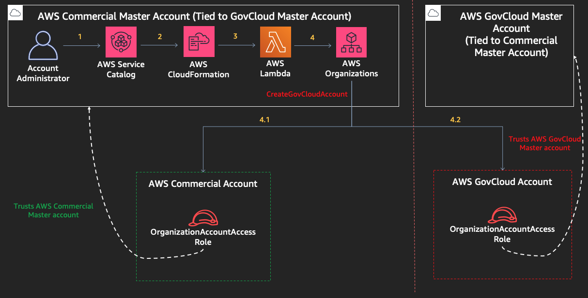
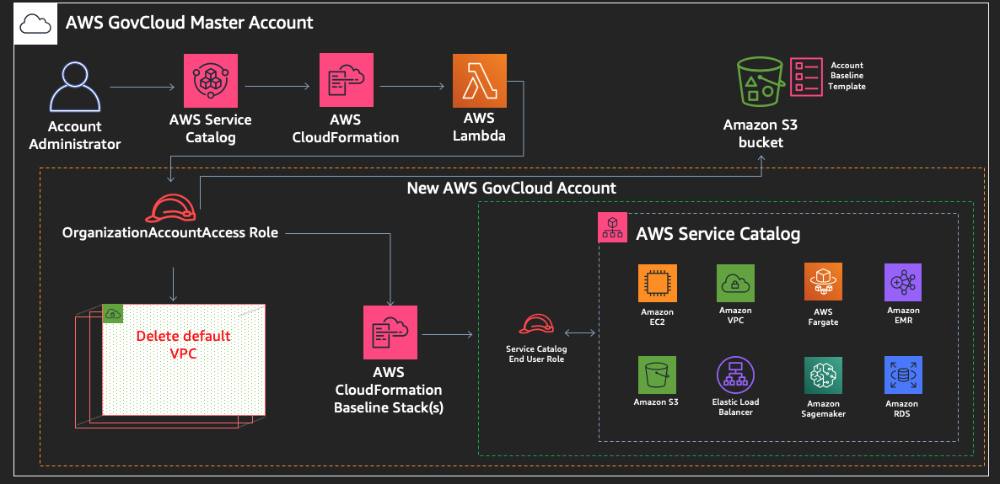
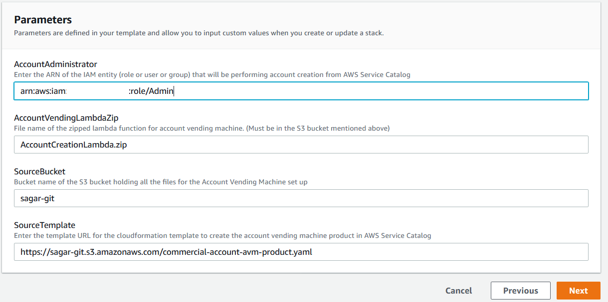
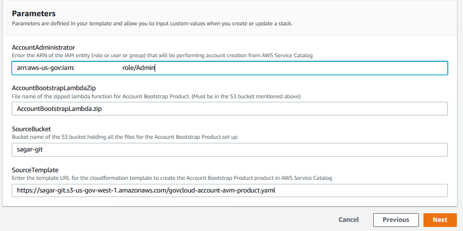
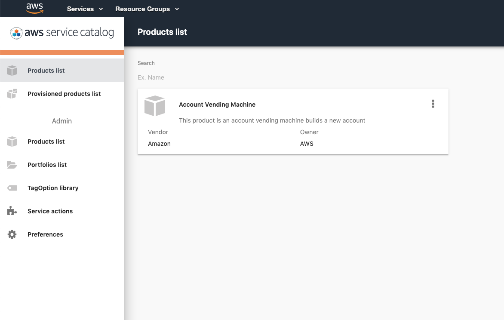
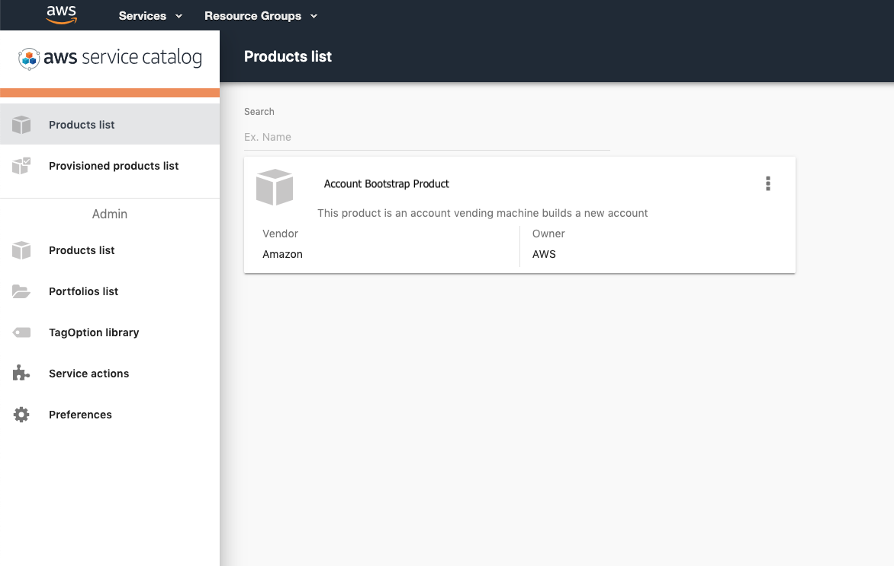
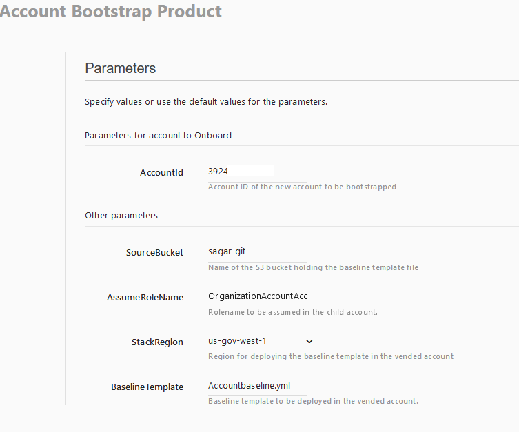
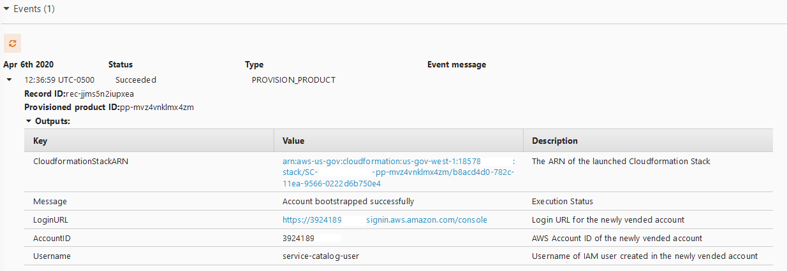
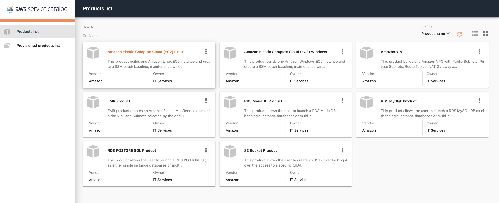

## AWS Account Vending Machine for GovCloud(US) region
AWS Organizations works differently in the AWS GovCloud(US) region, as compared to the commercial regions. For a deep dive, please refer the blog on [AWS Organizations in the AWS GovCloud (US) Regions for central governance and management of AWS accounts](https://aws.amazon.com/blogs/security/aws-organizations-available-govcloud-regions-central-governance-management-accounts/).

This guide contains a detailed description of the account vending machine used to provision AWS accounts with custom configurations in the AWS GovCloud(US) region.


## Overview
The account vending automation process for AWS GovCloud (US) will work in 2 separate steps. 

1. **Creation of the AWS GovCloud Account from the commercial region's master AWS account**

*Pre-Requisities*
* Existing AWS Organization in the commercial AWS account that forms the pair for the AWS GovCloud(US) region. Refer [documentation](https://docs.aws.amazon.com/govcloud-us/latest/UserGuide/govcloud-organizations.html)
* The account you deploy this in must meet the requirements to vend GovCloud accounts and leverage the API. Refer [documentation](https://docs.aws.amazon.com/govcloud-us/latest/UserGuide/govcloud-organizations.html)
* Each region you want to use this solution in should have its own S3 Bucket with the CloudFormation template and lambda function zip files

We will use the commercial organization’s master account to call the CreateGovCloudAccount API, which creates a new AWS account in the commercial organization, and another AWS account in the AWS GovCloud(US) region. A role (`OrganizationAccountAccess`) is automatically created in this new commercial account that creates a trust relationship your commercial organization master account to assume it, and a role (`OrganizationAccountAccess`) is automatically created in the AWS GovCloud(US) account which allows the AWS GovCloud(US) organization master account to assume it.  

In order to call the CreateGovCloudAccount API consistently, we will create an AWS Service Catalog product in the commercial organization master account, which would standardize the creation of the new account. The outputs of the AWS Service Catalog product would provide the account ID of the newly created accounts in the commercial and the GovCloud(US) regions. 

For set up of the commercial region's master AWS account, we will run an AWS CloudFormation template in that account. This CloudFormation template will set up an AWS Service Catalog product that will help vend AWS GovCloud(US) accounts.



2. **Bootstrapping of the newly created AWS GovCloud account**
The newly created AWS GovCloud(US) account from the previous step will contain a role (`OrganizationAccountAccess`) is automatically created in the AWS GovCloud(US) account which allows the AWS GovCloud(US) organization master account to assume it. 

We will need to perform the following steps in this newly created AWS GovCloud(US) account to get it ready for the end user:
* Invite the newly created AWS GovCloud(US) account to the AWS Organization in that region
* Accept the invite from the new account 
* Bootstrap the account with baseline infrastructure

To perform all these steps, as a one time activity in the AWS GovCloud master account, we will create an AWS Service Catalog product to bootstrap the newly created GovCloud account. This product will take the newly created AWS GovCloud(US) account ID as input, and launch an automation to create an AWS Organizations invite from the master, accept the invite from the new account, and finally bootstrap the newly created account with baseline infrastructure defined by the company.

For set up of the AWS GovCloud(US) region's master AWS account, we will run an AWS CloudFormation template in that account. This CloudFormation template will set up an AWS Service Catalog product that will help bootstrap newly created AWS GovCloud(US) accounts.

We can launch the AWS Service Catalog bootstrap product once we have the account ID of the newly created GovCloud account from the previous section.


## Step by Step walkthrough
### A) In the commercial region, setup the account vending machine (AVM) 
As a part of creating a sample account vending machine from this repository, you will first launch a CloudFormation template to create the account vending machine set up in your account.
1. Login to your AWS account which is a **master account** in AWS Organizations in the **commercial region**. 
_Note: You can customize this implementation to work with linked accounts as well, but for the purposes of this exercise, we will use the master account._
2. Set up an S3 bucket to hold all the artifacts for this implementation
	* Click on `Services`, then [Amazon S3](https://s3.console.aws.amazon.com/s3/home)
	* On the Amazon S3 console, click `Create S3 bucket`
	* Enter a bucket name of your choice and choose the commercial region you plan to use for this sample
	* Keep the defaults, and click `Create bucket`
	* Click on `Services`, then `AWS Organizations`
	* On the [AWS Organizations](https://console.aws.amazon.com/organizations) page, click on the `Settings` tab
	* Note the `Organization ID` on the settings page
	* Go back to the `Amazon S3` console page, click on the bucket you just created, and click on the `Permissions` tab
	* Click `Bucket Policy` and enter the following bucket policy: (Make sure you change the `Resource` and the `aws:PrincipalOrgId` to your Organization ID copied from AWS Organizations)
	 ```
		{
			"Version": "2012-10-17",
			"Statement": [
				{
					"Sid": "AllowGetObject",
					"Effect": "Allow",
					"Principal": "*",
					"Action": "s3:GetObject",
					"Resource": "arn:aws:s3:::<REPLACE WITH YOUR AMAZON S3 BUCKET NAME>/*",
					"Condition": {
						"StringEquals": {
							"aws:PrincipalOrgID": "<REPLACE WITH YOUR AWS ORGANIZATION ID>"
						}
					}
				}
			]
		}
	  ```
3. Upload all the files from the `commercial-side-setup` folder of this repository in the Amazon S3 bucket from the previous step
4. Copy the URL of the file `CommercialAccountSetup.yaml` from your Amazon S3 bucket
5. Click on `Services`, then select `CloudFormation`
6. Click the `Create Stack` button, add the Amazon S3 URL copied in step 4, and click `Next`.
7. On the `Specify stack details` page, enter the following parameters:
	- `AccountAdministrator` -  Enter the ARN of the IAM entity (role or user or group) that will be performing account creation from AWS Service Catalog. You can go to the IAM console to find the ARN of the role/user/group. (eg. arn:aws:iam::010010011111:role/Administrator)
	- `StackName` - Enter a stack name such as `account-vending-machine`
	- `SourceBucket` - Add the name of the Amazon S3 bucket you created in the commercial region
	- `AccountVendingLambdaZip` - File name of the zipped lambda function for Account Bootstrap Product.(Must be in the S3 bucket mentioned above)
	- `SourceTemplate` - Add your Amazon S3 URL for the source template. 
	- 
8. On the `Configure stack options` page, click `Next`.
9. On the `Review` page, check the checkbox for `I acknowledge that AWS CloudFormation might create IAM resources.`, and click `Create Stack`.

10. Once status of the stack changes to `CREATE COMPLETE`, click on the stack and open the `Outputs` tab to see the output values.
11. In the the `Outputs` section of AWS CloudFormation, copy the key and value column contents for `AccountVendingLambda`. You will be using this value during the execution of the account vending machine.

At this point, you have successfully set up the account vending machine in your commercial AWS account.

### B) In the AWS GovCloud(US) region, setup the account bootstrap product
As a part of creating a sample account bootstrap product from this repository, you will first launch a CloudFormation template to create the account account bootstrap product set up in your account.
1. Login to your AWS account which is a **master account** in AWS Organizations in the **AWS GovCloud(US) region**. 
_Note: You can customize this implementation to work with linked accounts as well, but for the purposes of this exercise, we will use the master account._
2. Set up an S3 bucket to hold all the artifacts for this implementation
	* Click on `Services`, then [Amazon S3](https://console.amazonaws-us-gov.com/s3/)
	* On the Amazon S3 console, click `Create S3 bucket`
	* Enter a bucket name of your choice and choose the AWS GovCloud(US) region you plan to use for this sample
	* Keep the defaults, and click `Create bucket`
	* Click on `Services`, then `AWS Organizations`
	* On the [AWS Organizations](https://console.amazonaws-us-gov.com/organizations/) page, click on the `Settings` tab
	* Note the `Organization ID` on the settings page
	* Go back to the `Amazon S3` console page, click on the bucket you just created, and click on the `Permissions` tab
	* Click `Bucket Policy` and enter the following bucket policy: (Make sure you change the `Resource` and the `aws:PrincipalOrgId` to your Organization ID copied from AWS Organizations)
	 ```
		{
			"Version": "2012-10-17",
			"Statement": [
				{
					"Sid": "AllowGetObject",
					"Effect": "Allow",
					"Principal": "*",
					"Action": "s3:GetObject",
					"Resource": "arn:aws-us-gov:s3:::<REPLACE WITH YOUR AMAZON S3 BUCKET NAME>/*",
					"Condition": {
						"StringEquals": {
							"aws:PrincipalOrgID": "<REPLACE WITH YOUR AWS ORGANIZATION ID>"
						}
					}
				}
			]
		}
	  ```
3. Upload all the files from the `govcloud-side-setup` folder of this repository in the Amazon S3 bucket from the previous step
4. Copy the URL of the file `GovCloudAccountSetup.yaml` from your Amazon S3 bucket
5. Click on `Services`, then select [AWS CloudFormation](https://console.amazonaws-us-gov.com/cloudformation/)
6. Click the `Create Stack` button, add the Amazon S3 URL copied in step 4, and click `Next`.
7. On the `Specify stack details` page, enter the following parameters:
	- `AccountAdministrator` -  Enter the ARN of the IAM entity (role or user or group) that will be performing account bootstrap from AWS Service Catalog. You can go to the IAM console to find the ARN of the role/user/group. (eg. arn:aws-gov-cloud:iam::010010011111:role/Administrator)
	- `StackName` - Enter a stack name such as `account-bootstrap-product`
	- `SourceBucket` - Add the name of the Amazon S3 bucket you created in the commercial region
	- `AccountBootstrapLambdaZip` - Keep the Default Value for this solution
	- `SourceTemplate` - Add your Amazon S3 URL for the source template 
	- 
8. On the `Configure stack options` page, click `Next`.
9. On the `Review` page, check the checkbox for `I acknowledge that AWS CloudFormation might create IAM resources.`, and click `Create Stack`.
    
10. Once status of the stack changes to `CREATE COMPLETE`, click on the stack and open the `Outputs` tab to see the output values.

At this point, you have successfully set up the account bootstrap product in your AWS GovCloud(US) account.

### C) In the commercial region, launch the account vending machine (AVM) to create new AWS accounts 
In this section, you will launch the account vending machine product created in AWS Service Catalog to create a new AWS account pre-configured with custom settings defined in this lab.
1. Login to your AWS account using the IAM role/user/group that you provided in the `AccountAdministrator` in the set up phase.
2.  On the Services menu, search and then choose `Service Catalog`. You will see an AWS Service Catalog product named `Account Vending Machine`.

3. In the `Products list` page, click `Account Vending Machine`, and then click `LAUNCH PRODUCT`.
4. On the `Product Version` page, configure:
    a. `Name`: my-new-account-001
    b. Select the available version.
5. Click `NEXT`
6. On the `Parameters` page, configure:
    - `AccountEmail`: Enter a unique email address to be associated with the newly created account
    - `OrganizationalUnitName`: Name of the organizational unit (OU) to which the account should be moved to. If the OU you provide doesn't exist, this solution will create it for you
	- `AccountName`: Enter an account name
7. Click `NEXT`.
8.  On the `TagOptions` page, provide your standard set of tagOptions, and/or click `NEXT`.
9.  On the Notifications page, provide your standard notification Amazon SNS topic, and/or click `NEXT`.
10.  On the Review page, review the configuration information, and click `LAUNCH`. This will create a CloudFormation stack. The initial status of the product is shown as `Under change`. Wait for about 5 minutes, then refresh the screen till the status changes to `AVAILABLE`. _Note: You can go to the AWS CloudFormation page to monitor the stack progress, or go to [Amazon CloudWatch](https://console.aws.amazon.com/cloudwatch/home) to view the step by step execution of the account vending lambda function._
11.  In the the `Outputs` section of AWS Service Catalog, you will see the account ID details of **both** of the newly created accounts as follows. Copy the account ID `GovCloudAccountID` of the AWS GovCloud(US) account, which we will use in the next step.
 

### D) In the AWS GovCloud(US) region, launch the account bootstrap product to bootstrap the newly created AWS GovCloud(US) account
In this section, you will launch the account bootstrap product created in AWS Service Catalog to create a new AWS account pre-configured with custom settings defined in this lab.
1. Login to your AWS GovCloud(US) account using the IAM role/user/group that you provided in the `AccountAdministrator` in the set up phase.
2.  On the Services menu, search and then choose [AWS Service Catalog](https://console.amazonaws-us-gov.com/servicecatalog/home). You will see an AWS Service Catalog product named `Account Bootstrap Product`. _Note: If you don't see this product, make sure you have logged in to this account with the role assigned to this AWS Service Catalog product. Read [documentation](https://docs.aws.amazon.com/servicecatalog/latest/adminguide/getstarted-deploy.html) for more information_

3. In the `Products list` page, click `Account Bootstrap Product`, and then click `LAUNCH PRODUCT`.
6. On the `Product Version` page, enter the following details:
    a. `Name`: my-new-account-001-bootstrap
    b. Select the available version.
7. Click `NEXT`
8. On the `Parameters` page, configure:
    - `AccountId`: Enter Account ID of the new account to be bootstrapped in AWS GovCloud (US). Get from Step C.
    - `SourceBucket`: Enter the name of the source bucket where your baseline CloudFormation template exists.
    - `AssumeRoleName`: Name of the IAM Role to be assumed in the child account. Keep the default value.
	- `StackRegion`: Choose the region where the preconfigured settings should be applied
	- `BaselineTemplate`: Keep the default value. OR Enter the name of the account baseline CloudFormation template.

9. Click `NEXT`.
10. On the `TagOptions` page, click `NEXT`.
11. On the Notifications page, click `NEXT`.
12. On the Review page, review the configuration information, and click `LAUNCH`. This will create a CloudFormation stack. The initial status of the product is shown as `Under change`. Wait for about 5 minutes, then refresh the screen till the status changes to `AVAILABLE`. _Note: You can go to the CloudFormation page to monitor the stack progress, or go to [Amazon CloudWatch](https://console.amazonaws-us-gov.com/cloudwatch/) to view the step by step execution of the account vending lambda function._
13. In the the `Outputs` section of AWS Service Catalog, you will see the account details of the bootstrapped account as follows.


### E) Login to the bootstrapped AWS GovCloud(US) account for end-user experience
In this section, we will log in to the newly vended account using the user created as a part of the set up and explore the account configuration.
1. Login to your AWS account using the `LoginURL` provided in the Outputs of the previous section. 
2. **Make sure you change over to the same region as the `StackRegion` in the previous section.**
3. On the credentials page, enter the following information:
	- Username: `service-catalog-user`
	- Password: `service-catalog-2020`
	_Note: You will be prompted to change your password at first log in._
4. On the Services menu, search and then choose [AWS Service Catalog](https://console.amazonaws-us-gov.com/servicecatalog/home). On the products list page, you will be to see the pre-configured AWS Service Catalog products allowed for the current user to provision.

4. As a part of the account setup, all the default VPCs from every region have been deleted for this account. You can validate this by going to the Services menu, search and then choose 'VPC'. 
5. As a security best practice of least privilege, we have restricted the current user to launch AWS Service Catalog products only. You can validate this by trying to create a new VPC from the [Amazon VPC console](https://console.amazonaws-us-gov.com/vpc/home).
	- Click on the `Launch VPC Wizard` button, and then click on `Select` for `VPC with a Single Public Subnet`.
	- In the `VPC Name` field, enter `demo`, and click `Create VPC`.
	- You will not be able to move forward from this page, due to lack of permissions.
	
6. Now, we will try to perform the same function using AWS Service Catalog. But first, the user will need a key pair. 
	- Go to the [Amazon EC2 console](https://console.amazonaws-us-gov.com/ec2)
	- In the left navigation menu, select `Key Pairs` under `Network & Security`
	- Click on the `Create a key pair` button, add name as `demo`, and click `Create`.
	- Now, on the Services menu, search and then choose `Service Catalog`. On the products list page, select `Amazon VPC`, and click on `Launch Product`.
	- On the `Product Version` page, configure:
    a. `Name`: `my-custom-vpc-001`
    b. Select the available version.
7. Click `NEXT`
8. On the `Parameters` page, configure:
    - `RegionAZ1Name`: Choose the availability zone for a region. eg. us-gov-west-1
    - `RegionAZ2Name`: Choose another availability zone for the **same** region as above. eg. us-gov-west-1
    - `VPCCIDR`: Keep the default value OR change it to a CIDR you want.
	- `SubnetAPublicCIDR`: Keep the default value OR change it to a CIDR you want
	- `SubnetAPublicCIDR`: Keep the default value OR change it to a CIDR you want
	- `SubnetAPrivateCIDR`: Keep the default value OR change it to a CIDR you want
	- `SubnetBPrivateCIDR`: Keep the default value OR change it to a CIDR you want
	- `CreateBastionInstance`: Keep the default value OR change it to `true` if you want a bastion instance created.
	- `BastionInstanceType`: Keep the default value OR change it to an instance type you want
	- `EC2KeyPair`: Choose the key pair you created in Step 6
	- `BastionSSHCIDR`: Enter any value you want eg. 0.0.0.0/0
	- `LatestAmiId`: Keep the default value OR change it to an AMI ID you want

9. Click `NEXT`.
10. On the `TagOptions` page, click `NEXT`.
11. On the Notifications page, click `NEXT`.
12. On the Review page, review the configuration information, and click `LAUNCH`. This will create a CloudFormation stack. The initial status of the product is shown as `Under change`. Wait for about 5 minutes, then refresh the screen till the status changes to `AVAILABLE`.
13. Validate the Outputs section on AWS Service Catalog screen to see the details of the VPC created. 
14. Finally, on the [Amazon VPC console](https://console.amazonaws-us-gov.com/vpc/home), you can verify that a VPC is now created.

In conclusion, you were able to log in as an end user in the newly vended AWS account, and create AWS resources in a compliant manner using AWS Service Catalog.

## Conclusion
This repository provides a method to enable on-demand creation of AWS accounts that can be customized to the requirements of an organization. Administrators and/or teams who are required to provision new accounts can use this approach to standardize the networking configuration and the resources that be provisioned when the new account is ready for use.

## Credits
This repository was inspired by the AWS blog post on [automation of AWS account creation](https://aws.amazon.com/blogs/mt/automate-account-creation-and-resource-provisioning-using-aws-service-catalog-aws-organizations-and-aws-lambda/).

## Clean Up
Congratulations! :tada: You have completed all the steps for setting up your own custom account vending machine using AWS Service Catalog. 

**To make sure you are not charged for any unwanted services, you can clean up by deleting the stack created in the _Deployment steps_ stage and its resources.**
To delete any AWS Service Catalog products, 
1. Go to the AWS Service Catalog screen and make sure you are in the same region as you selected during the launch phase
2. Go to the `Provisioned Products` screen, and terminate any products that you may have created as a part of the lab

To delete the stack and its resources
1. From the AWS CloudFormation console in the region you used in the _Lab Setup_, select the stack that you created.
2. Click `Delete Stack`.
3. In the confirmation message that appears, click `Yes`, `Delete`.

At this stage, the status for your changes to `DELETE_IN_PROGRESS`. In the same way you monitored the
creation of the stack, you can monitor its deletion by using the `Events` tab. When AWS CloudFormation completes the deletion of the stack, it removes the stack from the list.

You will see all your AWS Service Catalog products disappear at this point.
[(Back to top)](#aws-account-vending-machine)

## Contributing
Your contributions are always welcome! Please have a look at the [contribution guidelines](CONTRIBUTING.md) first. :tada:

[(Back to top)](#aws-account-vending-machine)

## License Summary

This sample code is made available under the MIT-0 license. See the LICENSE file.

[(Back to top)](#aws-account-vending-machine)